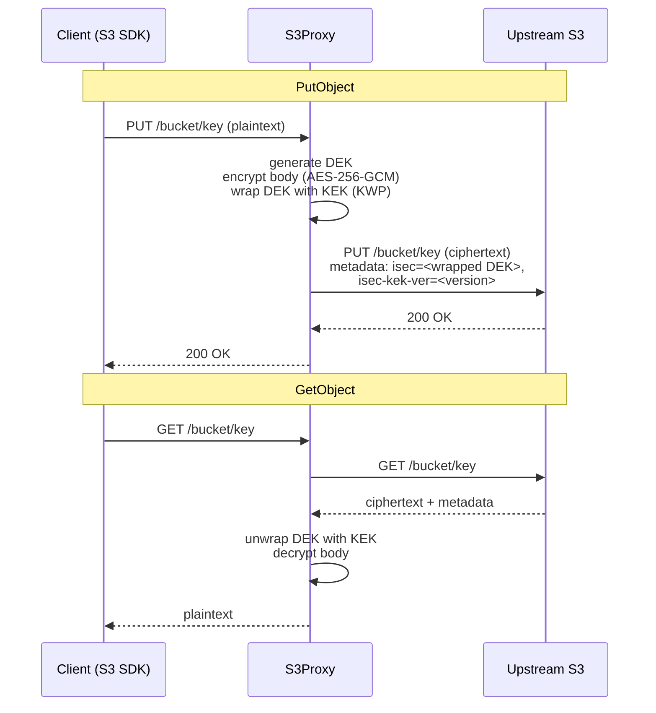

# S3Proxy

> Transparent AES-256-GCM encryption proxy for any S3-compatible backend.

[](https://github.com/Intrinsec/s3proxy/actions/workflows/ci.yml)
[](https://github.com/Intrinsec/s3proxy/actions/workflows/golangci-lint.yml)
[](https://github.com/Intrinsec/s3proxy/actions/workflows/docker-build-push.yml)
[](https://github.com/Intrinsec/s3proxy/actions/workflows/helm-push.yml)
[](go.mod)
[](LICENSE)

S3Proxy sits in front of an S3-compatible backend (AWS S3, Scaleway Object Storage, MinIO, …) and transparently encrypts `PutObject` bodies before they leave the cluster and decrypts `GetObject` responses before they reach the client. Clients keep talking plain S3; the data at rest is always ciphertext.

The project is a hardened fork of the original [edgelesssys/constellation](https://github.com/edgelesssys/constellation) s3proxy, focused on production deployments: structured logging, Prometheus metrics, OpenTelemetry tracing, opt-in migration helpers, a packaged Helm chart and bundled alerts/dashboards.

---

## Table of contents

- [Features](#features)
- [Quickstart](#quickstart)
  - [Docker](#docker)
  - [Kubernetes (Helm)](#kubernetes-helm)
- [Configuration](#configuration)
  - [Environment variables](#environment-variables)
  - [CLI flags](#cli-flags)
- [Operations](#operations)
  - [Metrics](#metrics)
  - [Alerts](#alerts)
  - [Tracing](#tracing)
  - [Logs](#logs)
  - [Health probes](#health-probes)
  - [Troubleshooting](#troubleshooting)
- [Multipart uploads](#multipart-uploads)
- [Security](#security)
- [Architecture](#architecture)
- [Helm chart reference](#helm-chart-reference)
- [Development](#development)
- [License](#license)

---

## Features

- **Server-side encryption proxy** — AES-256-GCM on PUT, transparent decryption on GET.
- **DEK/KEK envelope** — per-object random Data Encryption Key wrapped with a Key Encryption Key derived from a single seed via HKDF-SHA256.
- **S3-compatible** — works with any backend that speaks S3 v4 (AWS, Scaleway, MinIO, Wasabi, Ceph, …).
- **Secure defaults** — multipart uploads blocked, HTTPS upstream, request body capped, optional concurrency throttle.
- **Production observability** — Prometheus metrics on `/metrics`, four shipped alerts, OTLP/HTTP traces with `slog` log/trace correlation, ready-to-import Grafana dashboard.
- **Packaged Helm chart** — OCI-published, with opt-in `ServiceMonitor` / `PrometheusRule` / `GrafanaDashboard` CRD.

---

## Quickstart

### Docker

```bash
docker run --rm -p 4433:4433 \
  -e AWS_ACCESS_KEY_ID="…" \
  -e AWS_SECRET_ACCESS_KEY="…" \
  -e S3PROXY_HOST="s3.fr-par.scw.cloud" \
  -e S3PROXY_ENCRYPT_KEY="$(openssl rand -base64 32)" \
  ghcr.io/intrinsec/s3proxy
```

Point your S3 client at `https://localhost:4433` (or `http://` with `--no-tls`) and use the same bucket name as upstream. Objects land encrypted; `GetObject` returns plaintext.

### Kubernetes (Helm)

```bash
helm upgrade --install s3proxy oci://ghcr.io/intrinsec/s3proxy/charts/s3proxy
```

See [Helm chart reference](#helm-chart-reference) for the full value set.

---

## Configuration

All runtime configuration is sourced from environment variables. The Helm chart maps these onto `values.yaml` keys — see the [Helm chart reference](#helm-chart-reference).

### Environment variables

| Variable | Required | Default | Description |
|---|---|---|---|
| `S3PROXY_HOST` | yes | — | Upstream S3 endpoint hostname (e.g. `s3.eu-west-1.amazonaws.com`). |
| `S3PROXY_ENCRYPT_KEY` | yes | — | Seed for the Key Encryption Key. High-entropy random string (≥32 bytes recommended). |
| `AWS_ACCESS_KEY_ID` | yes | — | Upstream S3 credentials, consumed by the AWS SDK. |
| `AWS_SECRET_ACCESS_KEY` | yes | — | Idem. |
| `S3PROXY_THROTTLING_REQUESTSMAX` | no | `0` (off) | Cap on **concurrent in-flight requests** (not RPS). Excess requests are rejected. |
| `S3PROXY_PUTBODY_MAX` | no | `268435456` (256 MiB) | Per-request PutObject body size ceiling, in bytes. Up to `5368709120` (5 GiB, the S3 hard cap). |
| `S3PROXY_MULTIPART_BUFFER_DIR` | no | unset (disabled) | Enables **buffer-mode multipart**: parts are buffered to this local directory and assembled into a single encrypted PutObject on completion. Empty leaves multipart blocked. Mutually exclusive with `--allow-multipart`. **Single-instance / session-affinity only** — see [Multipart uploads](#multipart-uploads). |
| `S3PROXY_MULTIPART_MAX_SIZE` | no | `5368709120` (5 GiB) | Maximum assembled object size for a buffered multipart upload, in bytes. Clamped to 5 GiB (the S3 hard cap). Bounds peak RAM (~2× this) at completion. |
| `S3PROXY_MULTIPART_TTL` | no | `24h` | How long an idle buffered upload (and its on-disk parts) is retained before the background sweeper evicts it. Also bounds how long orphaned directories survive a restart. |
| `S3PROXY_DEKTAG_NAME` | no | `isec` | S3 object-metadata key used to store the encrypted DEK. |
| `S3PROXY_DEKTAG_KEKVER` | no | `<dektag>-kek-ver` | S3 object-metadata key recording which KEK derivation version wrapped the DEK. |
| `S3PROXY_INSECURE` | no | unset | Set to `1` to use plain HTTP (not HTTPS) when talking to upstream. **Dev / e2e only.** Emits a loud warning at startup. |
| `S3PROXY_DECRYPTION_FALLBACK` | no | unset | Set to `1` to retry `GetObject` with an all-zero KEK when the configured KEK fails. **One-shot migration helper** for moving away from objects written without an encryption key. Leave off in steady state. |
| `OTEL_EXPORTER_OTLP_ENDPOINT` | no | unset | OTLP/HTTP base endpoint. When this and `OTEL_EXPORTER_OTLP_TRACES_ENDPOINT` are both unset, tracing is disabled (no-op). |
| `OTEL_EXPORTER_OTLP_TRACES_ENDPOINT` | no | unset | Traces-specific OTLP/HTTP endpoint; takes precedence over `OTEL_EXPORTER_OTLP_ENDPOINT` when set. |
| `OTEL_EXPORTER_OTLP_HEADERS` | no | unset | Extra HTTP headers for the OTLP exporter (e.g. `authorization=Bearer …`). |

All other standard `OTEL_*` environment variables understood by the upstream OpenTelemetry Go SDK are honoured (sampler, resource attributes, …).

### CLI flags

```
--level int          slog verbosity: -1=Debug  0=Info (default)  1=Warn  2=Error
--no-tls             disable TLS, listen on plain HTTP port 80
--allow-multipart    forward multipart uploads to the upstream (WARNING: leaks unencrypted data)
--ip string          bind address (default "0.0.0.0")
--region string      AWS region of the target bucket (default "eu-west-1")
--cert string        TLS certificate directory (default "/etc/s3proxy/certs")
```

---

## Operations

### Metrics

S3Proxy exposes Prometheus metrics on `/metrics` (no authentication; scope via Network Policy).

| Metric | Type | Labels | Notes |
|---|---|---|---|
| `http_requests_total` | counter | `method`, `path`, `status` | Path is normalised to `/healthz`, `/readyz`, `/metrics` or `/:bucket/:key` to keep cardinality bounded. |
| `http_request_duration_seconds` | histogram | `method`, `path` | Default Prometheus buckets. |
| `errors_total` | counter | `type` | Internal error classes. |
| `service_crashes_total` | counter | — | Handler panics recovered by the HTTP middleware. |
| `s3proxy_encrypt_duration_seconds` | histogram | — | Time spent encrypting PutObject bodies. |
| `s3proxy_decrypt_duration_seconds` | histogram | — | Time spent decrypting GetObject bodies. |
| `s3proxy_upstream_errors_total` | counter | — | Errors talking to the upstream S3 endpoint. |
| `s3proxy_throttled_total` | counter | — | Requests rejected by the throttling middleware. |
| `s3proxy_multipart_uploads_active` | gauge | — | In-flight buffered multipart uploads (buffer mode only). |
| `s3proxy_multipart_buffer_bytes` | gauge | — | Bytes currently held on disk across all buffered multipart uploads. |
| `s3proxy_multipart_parts_total` | counter | — | Multipart parts buffered to disk. |
| `s3proxy_multipart_completed_total` | counter | — | Multipart uploads completed and stored upstream. |
| `s3proxy_multipart_aborted_total` | counter | — | Multipart uploads aborted by the client. |
| `s3proxy_multipart_assemble_duration_seconds` | histogram | — | Time spent assembling buffered parts into one object at completion. |

The default Go and process collectors (`go_*`, `process_*`) are also registered.

Enable the bundled `ServiceMonitor` to have kube-prometheus-stack scrape this automatically:

```yaml
serviceMonitor:
  enabled: true
  labels:
    release: kube-prometheus-stack
```

### Alerts

The chart ships a `PrometheusRule` (off by default) with six alerts. All thresholds and `for` windows are tunable via `values.yaml`.

| Alert | Severity | PromQL (default threshold) | Default `for` |
|---|---|---|---|
| `S3ProxyHighErrorRate` | critical | `sum(rate(http_requests_total{service="s3proxy",status=~"5.."}[5m])) / sum(rate(http_requests_total{service="s3proxy"}[5m])) > 0.05` | `10m` |
| `S3ProxyHighLatency` | warning | `histogram_quantile(0.95, sum by (le) (rate(http_request_duration_seconds_bucket{service="s3proxy"}[5m]))) > 2` | `10m` |
| `S3ProxyServiceDown` | critical | `up{job=~".*s3proxy.*"} == 0` | `2m` |
| `S3ProxyHighCrashRate` | critical | `increase(service_crashes_total{service="s3proxy"}[5m]) > 0` | `5m` |
| `S3ProxyMultipartBufferHigh` | warning | `s3proxy_multipart_buffer_bytes{service="s3proxy"} > 10737418240` (10 GiB) | `15m` |
| `S3ProxyMultipartUploadsStuck` | warning | `min_over_time(s3proxy_multipart_uploads_active{service="s3proxy"}[2h]) > 0` | `15m` |

The two multipart alerts only fire when buffer-mode multipart is enabled (`S3PROXY_MULTIPART_BUFFER_DIR`); otherwise the metrics stay at zero. Enable with:

```yaml
prometheusRule:
  enabled: true
  labels:
    release: kube-prometheus-stack
  thresholds:
    highErrorRate: 0.05
    highLatencySeconds: 2
    crashes: 0
    multipartBufferBytes: 10737418240
    multipartStuckUploads: 0
```

### Tracing

S3Proxy exports OTLP/HTTP traces when at least one of `OTEL_EXPORTER_OTLP_ENDPOINT` or `OTEL_EXPORTER_OTLP_TRACES_ENDPOINT` is set. The default propagator is W3C TraceContext, so incoming `traceparent` headers are honoured and span IDs are propagated to the upstream S3 call.

Every log line emitted by `slog` is augmented with the active `trace_id` and `span_id` from the request context (see `internal/tracing.NewSpanContextHandler`), giving one-to-one correlation between logs and traces in stacks like Grafana / Tempo / Loki.

Enable in the chart:

```yaml
config:
  otlpTracesEndpoint: https://otel-collector.observability.svc.cluster.local:4318/v1/traces
  otlpHeaders: "authorization=Bearer …"   # optional
```

### Logs

Structured JSON on stdout via Go's `log/slog`. Each record carries `service=s3proxy` plus the contextual `trace_id` / `span_id` when tracing is active. Verbosity is controlled at start time via `--level`:

```yaml
args: ["--level=-1"]   # Debug, use only for troubleshooting
```

### Health probes

| Endpoint | Purpose | Notes |
|---|---|---|
| `/healthz` | Liveness | Always returns `200 OK` while the HTTP server is up. |
| `/readyz` | Readiness | Probes the **upstream S3 endpoint**. The pod is taken out of rotation when the backend is unreachable, so failed scrapes correlate with the `S3ProxyServiceDown` alert. |

### Troubleshooting

- **Enable Debug logs** — `args: ["--level=-1"]` in `values.yaml`.
- **Run against MinIO over plain HTTP** for e2e tests — set `S3PROXY_INSECURE=1` (and read the startup warning).
- **Migrate from unencrypted objects** — temporarily set `S3PROXY_DECRYPTION_FALLBACK=1`; GetObjects that fail to decrypt with the configured KEK are retried with an all-zero KEK so legacy objects keep flowing during the cutover. Disable as soon as the migration completes.
- **Investigate latency spikes** — compare `s3proxy_{encrypt,decrypt}_duration_seconds` against `http_request_duration_seconds` to locate the bottleneck (proxy CPU vs. upstream).
- **Investigate panics** — every recovered panic increments `service_crashes_total` and surfaces a stack trace in the JSON logs; correlate via `trace_id`.

---

## Multipart uploads

Multipart uploads are **blocked by default** (the four multipart endpoints return `501`). Many SDKs auto-switch to multipart above a size threshold, so large uploads fail unless one of two opt-in modes is enabled:

- **Forward mode** (`--allow-multipart`) — parts are forwarded to the upstream **unencrypted**. Leaks plaintext at rest; avoid unless you accept that.
- **Buffer mode** (`S3PROXY_MULTIPART_BUFFER_DIR`) — parts are buffered to local disk and, on `CompleteMultipartUpload`, concatenated, encrypted (the same AES-256-GCM envelope path as single PutObject) and written upstream as a **single ciphertext object**. Data at rest stays encrypted.

The two modes are mutually exclusive; setting both is a startup error.

### Buffer-mode constraints

- **Single instance / session affinity (hard requirement).** Buffers and the in-flight-upload table are node-local. Every `UploadPart` and the final `CompleteMultipartUpload` for an upload **must reach the same pod that created it**. Run a single replica, or pin client sessions to one pod (e.g. sticky sessions / `sessionAffinity: ClientIP`). There is no distributed/shared state.
- **Size and memory cap.** The crypto path is two-pass and cannot stream, so the whole object is assembled in RAM at completion (peak ≈ 2× object size). `S3PROXY_MULTIPART_MAX_SIZE` (default and hard cap 5 GiB) bounds this; oversized parts/objects are rejected with `413`. Size the pod's memory accordingly.
- **Disk usage.** Buffered parts occupy `S3PROXY_MULTIPART_BUFFER_DIR` until the upload completes or its TTL expires. A background sweeper evicts uploads idle longer than `S3PROXY_MULTIPART_TTL` (default 24h) and, on restart, reclaims orphaned directories left by the lost in-memory table. Watch `s3proxy_multipart_buffer_bytes` and the `S3ProxyMultipartBufferHigh` alert; provision the volume for your concurrency × object size.
- **Durability / ack ordering.** `CompleteMultipartUpload` returns `200` only after the upstream `PutObject` succeeds (using a detached context so a client disconnect cannot abort an in-flight store). An `UploadPart` `200` means "part buffered", not "object stored" — identical to real S3. A crash before upstream success fails `Complete` (the client retries); a crash after success but before the `200` leaves the object durably stored, so a retry is at worst a redundant overwrite.
- **ETags.** Per-part ETags are synthesized MD5s and the final object ETag is the upstream object's ETag, **not** S3's composite `md5-of-md5s-N` form. Standard SDKs do not validate the composite, so this is transparent in practice.
- **`ListParts` is not supported** in buffer mode (returns `501`); SDK upload managers that complete from their own tracked part list are unaffected.

---

## Security

S3Proxy is designed for at-rest data protection in front of an S3-compatible backend that you do not fully trust (multi-tenant object storage, third-party cloud, …). It is **not** a substitute for IAM, network controls, or end-to-end client-side encryption.

- **Cipher** — AES-256-GCM for object bodies (via [`tink-crypto/tink-go`](https://github.com/tink-crypto/tink-go)).
- **Key wrapping** — per-object DEKs are wrapped with NIST SP-800-38F Key-Wrap-with-Padding (KWP).
- **KEK derivation** — the seed (`S3PROXY_ENCRYPT_KEY`) is hardened with HKDF-SHA256; the derivation version is recorded on every object (`<dektag>-kek-ver` metadata) so future KEK rotations stay backward-compatible.
- **Body cap** — PutObject bodies are bounded to `S3PROXY_PUTBODY_MAX` (default 256 MiB, hard cap 5 GiB) to limit memory pressure and DoS surface.
- **Multipart blocked by default** — the four multipart endpoints (`CreateMultipartUpload`, `UploadPart`, `CompleteMultipartUpload`, `AbortMultipartUpload`) are refused unless either multipart mode is opted into. **`--allow-multipart` forwards parts to the upstream unencrypted** — only use it when you understand and accept that. For encrypted multipart, enable **buffer mode** (`S3PROXY_MULTIPART_BUFFER_DIR`) instead: parts are buffered locally and stored upstream as a single ciphertext PutObject, so data at rest stays encrypted. See [Multipart uploads](#multipart-uploads) for its constraints. The two modes are mutually exclusive.
- **Upstream HTTPS by default** — `S3PROXY_INSECURE=1` is a dev/e2e knob and emits a loud warning at startup. Production deployments must leave it unset.
- **Decryption fallback** — `S3PROXY_DECRYPTION_FALLBACK=1` re-tries decryption with an all-zero KEK to bridge migrations away from unencrypted data. It is a migration helper, not a steady-state option; switch it back off once the migration finishes.
- **KEK rotation** — currently a single active KEK is supported. The KEK-version metadata is in place for a future multi-KEK rotation flow, but operational KEK rotation is not yet implemented.

The threat model and detailed crypto notes live alongside the code in `internal/cryptoutil`.

---

## Architecture

S3Proxy is a transparent HTTP proxy. It re-signs every request to the upstream S3 API with the configured AWS credentials, so client-side signatures do not need to be preserved.



Key packages:

- `cmd/main.go` — entry point. Parses CLI flags, builds the slog-based JSON logger, loads config (`koanf`), wires OpenTelemetry tracing, starts the HTTP(S) server.
- `internal/router` — request interception and routing. Dispatches PUT/GET/multipart/health/metrics endpoints, applies optional throttling, re-signs every upstream request with the proxy's credentials.
- `internal/s3` — thin wrapper around the AWS SDK v2 S3 client, with middleware that captures raw HTTP responses for robust error handling.
- `internal/cryptoutil` — DEK/KEK envelope, AES-256-GCM, KWP, HKDF-SHA256-based KEK derivation.
- `internal/config` — env-var-driven configuration via `koanf`, plus validation (size caps, required fields).
- `internal/monitoring` — Prometheus collectors and the `Instrument` middleware.
- `internal/tracing` — OTLP/HTTP exporter setup and the `slog` handler that injects trace/span IDs into log records.

---

## Helm chart reference

The chart is published as an OCI artifact at `oci://ghcr.io/intrinsec/s3proxy/charts/s3proxy`. Source lives under [`charts/s3proxy`](charts/s3proxy).

Top-level value keys:

| Key | Default | Purpose |
|---|---|---|
| `replicaCount` | `1` | Number of replicas (ignored when `autoscaling.enabled`). |
| `deploymentStrategy` | `RollingUpdate` | Standard k8s Deployment strategy. |
| `image.repository` / `image.tag` / `image.pullPolicy` | `ghcr.io/intrinsec/s3proxy` / chart appVersion / `Always` | Container image. |
| `args` | `["--level=0"]` | CLI flags (see [CLI flags](#cli-flags)). |
| `cert` | disabled | CertManager integration. |
| `config.host` | — | Upstream S3 host. |
| `config.throttling` | unset | `S3PROXY_THROTTLING_REQUESTSMAX` (concurrent in-flight cap). |
| `config.accessKey` / `config.secretKey` / `config.encryptKey` | unset | Credentials and KEK seed; rendered into the `s3proxy` Secret. |
| `config.otlpEndpoint` / `config.otlpTracesEndpoint` / `config.otlpHeaders` | unset | OTLP/HTTP tracing exporter. |
| `valsSecret` | `{}` | Use [`vals`-style refs](https://github.com/helmfile/vals) to source credentials from Vault / SSM / etc. |
| `extraEnv` | `[]` | Append-only env vars; use for opt-in `S3PROXY_*` knobs not in `config`. |
| `service.type` / `service.port` | `ClusterIP` / `4433` | Standard k8s Service. |
| `ingress.enabled` | `false` | Optional Ingress. |
| `resources` | `cpu: 250m/500m`, `mem: 128Mi/256Mi` | k8s requests/limits. |
| `livenessProbe` / `readinessProbe` | `/healthz` / `/readyz` on `4433` (HTTPS) | Standard probes. |
| `autoscaling` | disabled | HPA on CPU/memory. |
| `serviceMonitor` | disabled | Prometheus Operator scrape config. |
| `prometheusRule` | disabled | Alert bundle. |
| `grafanaDashboard` | disabled | `GrafanaDashboard` CRD (`grafana.integreatly.org/v1beta1`, grafana-operator). |

A complete observability rollout looks like:

```yaml
serviceMonitor:
  enabled: true
  labels:
    release: kube-prometheus-stack
prometheusRule:
  enabled: true
  labels:
    release: kube-prometheus-stack
  thresholds:
    highErrorRate: 0.05
    highLatencySeconds: 2
grafanaDashboard:
  enabled: true
  folder: s3proxy
  instanceSelector:
    matchLabels:
      dashboards: grafana
config:
  host: s3.fr-par.scw.cloud
  otlpTracesEndpoint: https://otel-collector.observability.svc.cluster.local:4318/v1/traces
extraEnv:
  - name: S3PROXY_PUTBODY_MAX
    value: "536870912"   # 512 MiB
```

---

## Development

- **Go version** — 1.26 (see `go.mod`).
- **Vendored dependencies** — the `vendor/` tree is committed. Build with `-mod=vendor` (the default once `vendor/` is present) so reproducible builds do not hit the proxy.
- **Build tags** — the MinIO end-to-end test sits behind the `e2e` tag (`go test -tags e2e ./...`); unit tests run by default.
- **Tooling** — `golangci-lint` and `govulncheck` are wired into CI. Local install hints live in [AGENTS.md](AGENTS.md).
- **CI workflows** —
  - `.github/workflows/ci.yml` — `go test -race` with coverage upload
  - `.github/workflows/golangci-lint.yml` — lint
  - `.github/workflows/docker-build-push.yml` — multi-arch image build & push to GHCR
  - `.github/workflows/helm-push.yml` — chart push to GHCR OCI registry

See [CONTRIBUTING.md](CONTRIBUTING.md) for the dev-container setup.

---

## License

[AGPL-3.0-only](LICENSE). Originally derived from [edgelesssys/constellation](https://github.com/edgelesssys/constellation), which is itself AGPL-3.0-only.
